# Todoshit


---

Проект находится в стадии разработки

## О проекте

Изначально, данный проект был создан в целях укрепить навыки разработки REST веб-приложений.
Он может помочь вам в случае, если вам трудно держать все дела в голове.

## Roadmap

- [x] Backend часть
    - [x] Админ-панель
    - [x] Система авторизации
    - [x] Система окружений
    - [x] Система тикетов
    - [x] Система тегов
    - [x] Автоматическая генерация Swagger документации
- [ ] Frontend часть
    - [x] Работа с окружениями (Смена, добавление, изменение, удаление)
    - [x] Привязка горячих клавиш (Панель быстрых действий, справка, смена темы, управление окружением)
    - [x] Справка по горячим клавишам
    - [x] Смена темы "на лету"
    - [x] Просмотр созданных тикетов
    - [ ] Работа с тикетами (Добавление, редактирование, удаление)
    - [ ] Работа с тегами (Добавление, удаление, редактирование)

## Функционал

В данной секции будут рассмотрены основные функции веб-приложения

### Back-end

Backend приложения построен на фреймворке Django в связке с Djangorestframework

Он обладает такими функциями как:

- Система аккаунтов и JWT авторизации (при помощи [dj-rest-auth](https://github.com/iMerica/dj-rest-auth))
- Система окружений
- Система тикетов
- Система тегов
- Автоматическая генерация Swagger (при помощи [drf-spectacular](https://github.com/tfranzel/drf-spectacular))
- Админ панель (с темой [Unfold](https://github.com/unfoldadmin/django-unfold))

### Front-end

Frontend приложения реализован на фреймворке [Nuxt](https://nuxt.com/) (Vue)

Значимые моменты, которые хотелось бы отметить:

- Интерфейс реализован полностью на дизайн-системе [Nuxt UI](https://ui.nuxt.com/)
- Каждый интерактивный элемент можно открывать как по соответствующей кнопке, так и при помощи горячей клавиши
- Есть поддержка как светлой, так и темной темы

## Установка

### Docker Compose

Скоро...

### Локальная установка

Скопируйте репозиторий

```shell
git clone https://github.com/revolexGeek/todoshit
```

#### Frontend

Перейдите в папку с Front-end частью

```shell
cd src/frontend
```

Установите зависимости удобным для вас пакетным менеджером

```shell
npm i
```

```shell
pnpm i
```

```shell
yarn i
```

```shell
bun i
```

Запустите проект в Dev режиме (на примере [Bun](https://bun.sh/))

```shell
bun run dev
```

#### Backend

Перейдите в папку с Back-end частью

```shell
cd src/backend
```

(Предположим, что у вас уже установлен [Poetry](https://python-poetry.org/))

Установите зависимости через Poetry

```shell
poetry install
```

Создайте копию .env файла-примера

```shell
cp .env.example .env
```

Настройте .env файл

```dockerfile
DJANGO_SECRET_KEY=GENERATE_NEW_SECRET_KEY
DJANGO_DEBUG=True  #  Use django debug?
### Postgres connection string settings
DJANGO_USE_POSTGRES_DB=True  #  Use postgres as main database? // else: SQLite
DJANGO_DB_NAME=YOUR_DB_NAME
DJANGO_DB_USER=YOUR_DB_USER
DJANGO_DB_PASSWORD=YOUR_DB_PASSWORD
DJANGO_DB_HOST=YOUR_DB_HOST
DJANGO_DB_PORT=5432  #  Change if needed
### Internationalization
DJANGO_INTERNATIONALIZATION_LANGUAGE_CODE=ru-ru  #  Default: en-us
DJANGO_INTERNATIONALIZATION_TIME_ZONE=Europe/Moscow  #  Default: UTC
DJANGO_INTERNATIONALIZATION_USE_I18N=True  #  Default: True
DJANGO_INTERNATIONALIZATION_USE_L10N=True  #  Default: True
DJANGO_INTERNATIONALIZATION_USE_TZ=True  #  Default: True
### Superuser settings
DJANGO_SUPERUSER_USERNAME=admin
DJANGO_SUPERUSER_EMAIL=admin@example.org
DJANGO_SUPERUSER_PASSWORD=password
### Hosts & Cors
DJANGO_ALLOWED_HOSTS=  #  If needed. Example: 111.111.111.111,222.222.222.222,
DJANGO_CORS_ALLOWED_ORIGINS=  #  If needed. Example: http://111.111.111.111,https://222.222.222.222
```

(_Если используете Postgres в настройках_) Создайте базу данных через PSQL

Не забудьте поменять <your_database_name> на имя базы данных, указанное в конфигурации (DJANGO_DB_NAME).

```postgresql
CREATE DATABASE your_database_name;
```

Запустите миграции

```shell
python manage.py migrate
```

(_Опционально_)
Создайте аккаунт администратора (для админ панели)

```shell
python manage.py createsuperuser
```

Запустите проект

```shell
python manage.py runserver
```

## Галерея

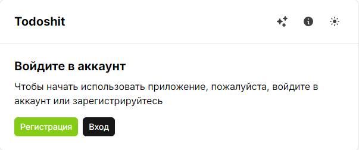

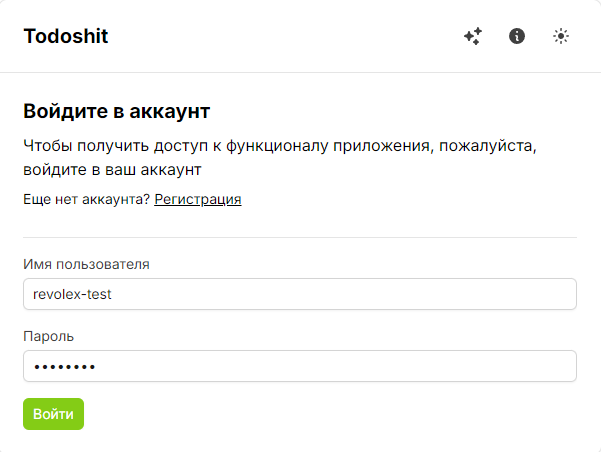

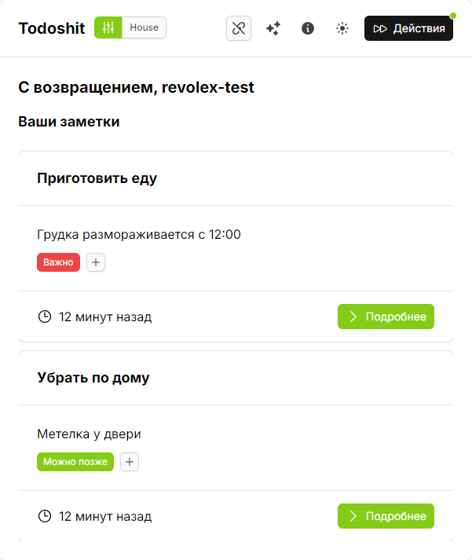

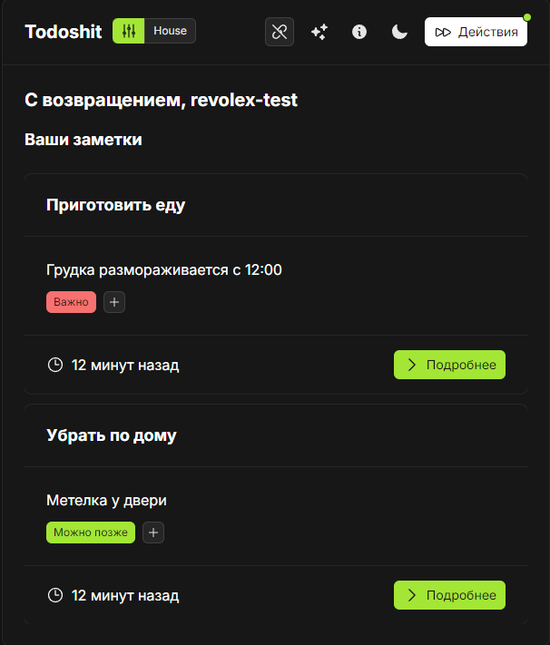

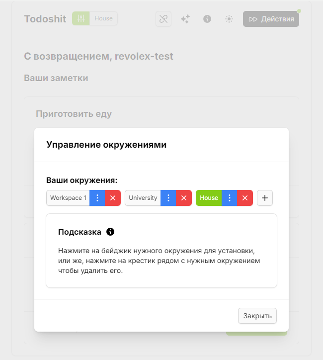

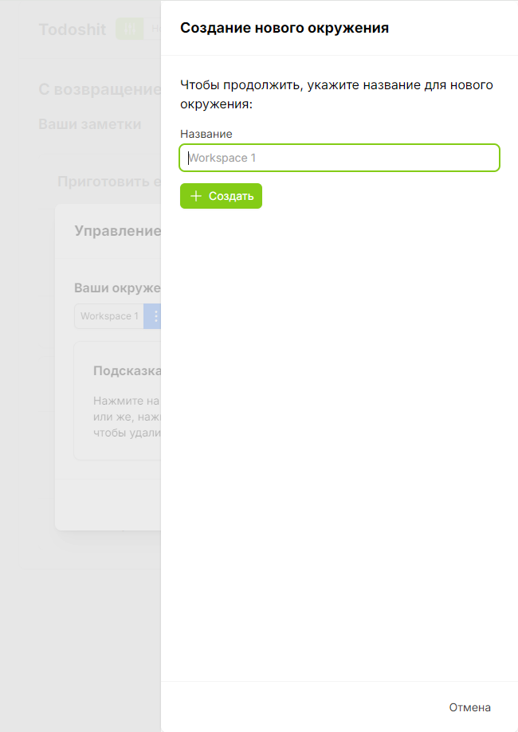

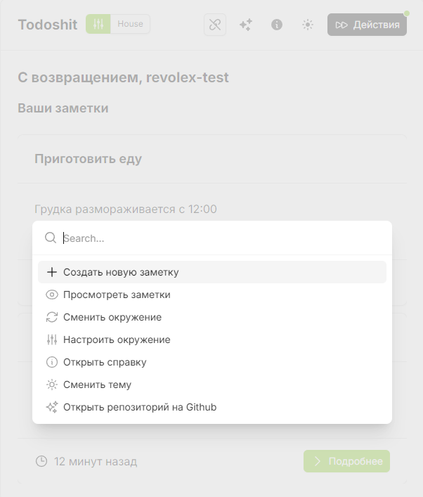

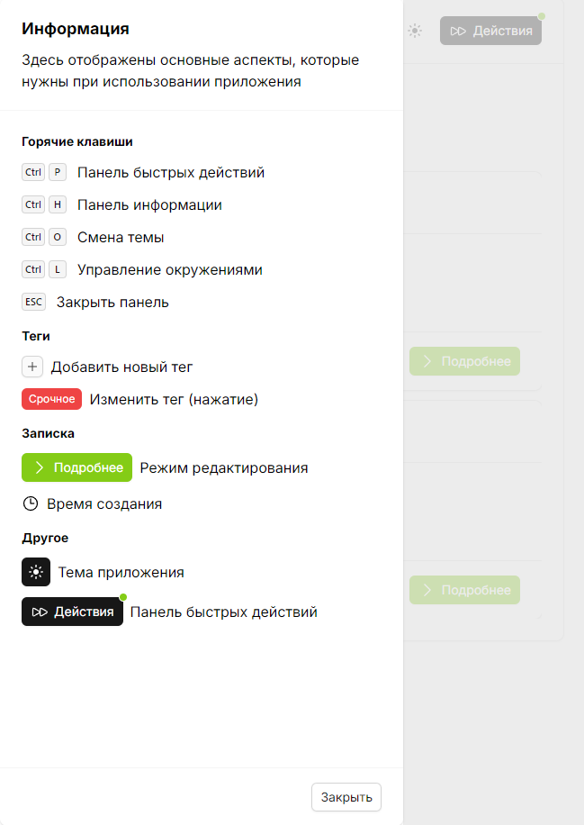

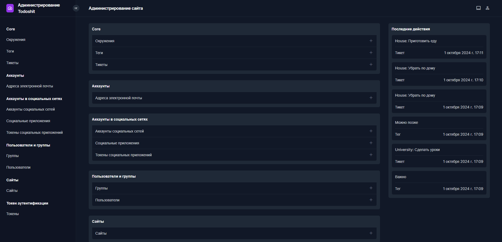

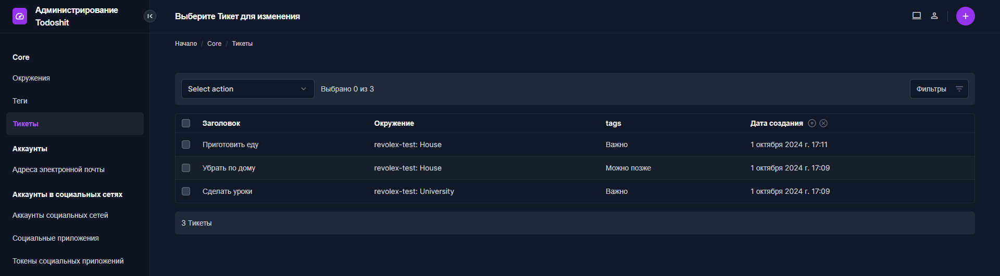

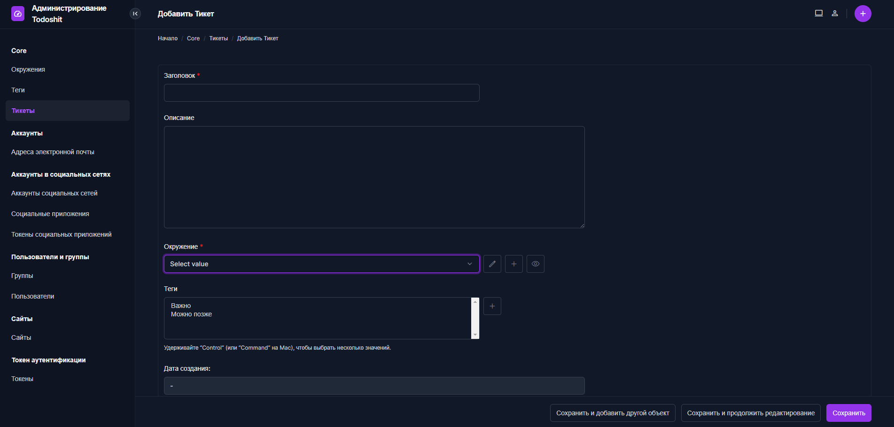